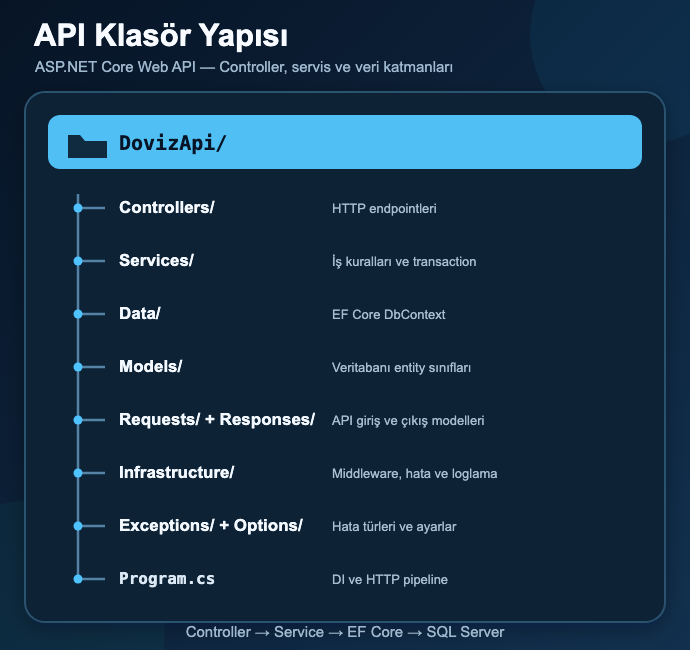
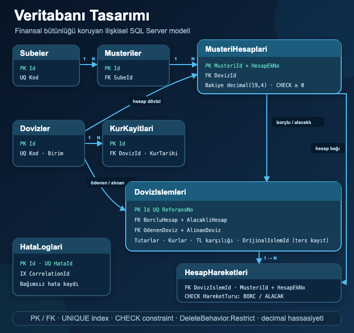

# Döviz İşlemleri ve Arbitraj Yönetim API'si

ASP.NET Core 8, Entity Framework Core ve SQL Server ile geliştirilmiş; müşteri, şube, döviz hesabı, döviz dönüşümü, işlem geçmişi, ters kayıt, teorik arbitraj ve merkezi hata yönetimi özelliklerini sağlayan backend API uygulamasıdır.

Proje, finansal işlemlerde veri bütünlüğünü korumaya odaklanır. Döviz dönüşümünde bakiye güncellemeleri, işlem kaydı ve hesap hareketleri tek bir veritabanı transaction'ı içerisinde tamamlanır. Hata oluştuğunda işlem rollback edilir ve kısmi veri değişikliği bırakılmaz.

> Bu repository yalnızca backend API ve veritabanı/dağıtım dosyalarını içerir. Next.js frontend ayrı bir uygulamadır ve bu API'yi HTTP üzerinden tüketir.

## İçindekiler

- [Özellikler](#özellikler)
- [Kullanılan teknolojiler](#kullanılan-teknolojiler)
- [Sistem mimarisi](#sistem-mimarisi)
- [Proje yapısı](#proje-yapısı)
- [Veritabanı tasarımı](#veritabanı-tasarımı)
- [Döviz dönüşümü ve transaction](#döviz-dönüşümü-ve-transaction)
- [Arbitraj modülü](#arbitraj-modülü)
- [Merkezi hata yönetimi](#merkezi-hata-yönetimi)
- [Correlation ID](#correlation-id)
- [Loglama ve hassas veri güvenliği](#loglama-ve-hassas-veri-güvenliği)
- [Local kurulum](#local-kurulum)
- [API endpointleri](#api-endpointleri)
- [Örnek istekler](#örnek-istekler)
- [Docker ve Dokploy dağıtımı](#docker-ve-dokploy-dağıtımı)
- [Test ve doğrulama](#test-ve-doğrulama)
- [Bilinen sınırlamalar](#bilinen-sınırlamalar)

## Özellikler

- Şube oluşturma ve listeleme
- Müşteri oluşturma, arama, filtreleme ve sayfalama
- Müşteri adına farklı para birimlerinde ek hesap açma
- TCMB günlük XML servisinden alış ve satış kuru alma
- Hesaplar arasında döviz dönüşümü
- Bakiye yetersizliği ve eş zamanlı işlem kontrolü
- Döviz işlem geçmişi ve detay görüntüleme
- Hesap hareketlerini `BORC` ve `ALACAK` türleriyle saklama
- İşlemi silmeden ters finansal kayıt oluşturarak iptal etme
- Üç para birimi arasında teorik arbitraj hesaplama
- RFC 7807 yaklaşımına uygun standart hata sözleşmesi
- Her istek için correlation ID üretimi ve takibi
- SQL Server `HataLoglari` tablosuna hata kaydı
- Serilog ile structured logging
- Opsiyonel Elasticsearch ve Kibana entegrasyonu
- Hassas request alanlarını maskeleme
- Swagger/OpenAPI dokümantasyonu
- Docker ve Dokploy dağıtım desteği
- `/health` sağlık kontrolü

## Kullanılan teknolojiler

| Teknoloji | Kullanım amacı |
|---|---|
| .NET 8 | Uygulama çalışma ortamı |
| ASP.NET Core Web API | HTTP API ve middleware pipeline |
| C# | Uygulama dili |
| Entity Framework Core 8 | SQL Server veri erişimi ve ilişki konfigürasyonu |
| SQL Server 2022 | Kalıcı veri, transaction, index ve constraint yönetimi |
| `IHttpClientFactory` | TCMB servis bağlantısı ve timeout yönetimi |
| Swagger / OpenAPI | Endpoint dokümantasyonu ve manuel API kontrolü |
| Serilog | Structured console logging |
| Elastic Serilog Sink | Elasticsearch'e structured hata logu gönderimi |
| Elasticsearch | Merkezi log depolama ve arama |
| Kibana | Elasticsearch loglarını sorgulama ve görselleştirme |
| Docker / Docker Compose | Container tabanlı dağıtım |
| Dokploy / Traefik | Production deployment, domain ve HTTPS yönetimi |

Temel NuGet paketleri:

```text
Microsoft.EntityFrameworkCore.SqlServer  8.0.29
Serilog.AspNetCore                       8.0.3
Elastic.Serilog.Sinks                    9.0.0
Swashbuckle.AspNetCore                   6.6.2
```

## Sistem mimarisi

```text
Next.js Frontend
        ↓
Next.js Proxy Routes
        ↓ HTTP / JSON
ASP.NET Core Controllers
        ↓
Application Services
   ┌────┴───────────────┐
   ↓                    ↓
EF Core             TCMB XML Servisi
   ↓
SQL Server
```

Hata akışı:

```text
HTTP isteği
   ↓
CorrelationIdMiddleware
   ↓
Controller / Service / EF Core
   ↓ hata
GlobalExceptionHandler
   ├── Güvenli HTTP hata cevabı
   ├── SQL HataLoglari
   ├── Serilog console
   └── Elasticsearch → Kibana
```

Uygulama mikroservis değil, Controller–Service ağırlıklı katmanlı bir monolittir. Döviz dönüşümü, arbitraj ve TCMB entegrasyonu servis katmanında yürütülür. Bazı müşteri ve şube işlemleri mevcut yapıda controller üzerinden doğrudan `DovizDbContext` kullanır.

## Proje yapısı



```text
DovizApi/
├── DovizApi/
│   ├── Controllers/       HTTP endpointleri
│   ├── Services/          İş kuralları, transaction, TCMB ve arbitraj
│   ├── Data/              EF Core DbContext
│   ├── Models/            Veritabanı entity sınıfları
│   ├── Requests/          API giriş modelleri
│   ├── Responses/         API çıkış modelleri
│   ├── Exceptions/        Uygulama exception türleri
│   ├── Infrastructure/    Middleware, global hata ve loglama altyapısı
│   ├── Options/           Yapılandırma modelleri
│   ├── Program.cs         DI ve HTTP pipeline
│   └── DovizApi.csproj
├── Database/
│   ├── 005_FullDatabaseSetup.sql
│   ├── 006_AddDovizIslemiTersKayit.sql
│   ├── 007_AddHataLoglari.sql
│   ├── Dockerfile
│   └── docker-entrypoint.sh
├── Dockerfile
├── docker-compose.dokploy.yml
├── DOKPLOY_KURULUMU.md
├── ELASTICSEARCH_KURULUMU.md
└── PROJE_ANLATIMI.md
```

## Veritabanı tasarımı



| Tablo | Açıklama |
|---|---|
| `Subeler` | Şube kodu, adı ve aktiflik durumu |
| `Musteriler` | Müşteri bilgileri ve bağlı olduğu şube |
| `MusteriHesaplari` | Müşterinin para birimi bazlı ek hesapları ve bakiyesi |
| `Dovizler` | Desteklenen para birimleri ve TCMB birim değeri |
| `KurKayitlari` | Tarih bazlı alış ve satış kurları |
| `DovizIslemleri` | Kaynak/hedef hesap, kur, miktar ve referans bilgileri |
| `HesapHareketleri` | İşleme bağlı `BORC` ve `ALACAK` hareketleri |
| `HataLoglari` | Merkezi SQL hata kayıtları |

Başlıca veri bütünlüğü kuralları:

- `MusteriHesaplari` composite primary key: `MusteriId + HesapEkNo`
- Bakiye için `Bakiye >= 0` check constraint'i
- Hesap ek numarası için `HesapEkNo >= 5001` kontrolü
- Borçlu ve alacaklı hesabın aynı olmasını engelleyen constraint
- Ödenen ve alınan dövizin aynı olmasını engelleyen constraint
- Döviz işlem tutarı ve kur değerlerinin sıfırdan büyük olması
- `Dovizler.Kod`, `Subeler.Kod` ve `DovizIslemleri.ReferansNo` unique indexleri
- Bir işlem için yalnızca bir ters kayıt oluşturulmasını sağlayan filtreli unique index
- Kritik foreign key ilişkilerinde `DeleteBehavior.Restrict`
- Bakiye ve miktarlarda `decimal(19,4)`
- Kur değerlerinde `decimal(19,6)`

### SQL şema yönetimi

Bu projede EF Core Migration kullanılmamaktadır. Şema, sıralı SQL kurulum/güncelleme scriptleriyle yönetilir. Scriptleri sırasıyla çalıştırın:

1. `Database/005_FullDatabaseSetup.sql`
2. `Database/006_AddDovizIslemiTersKayit.sql`
3. `Database/007_AddHataLoglari.sql`

Dokploy Compose dağıtımında bu sıra SQL container entrypoint'i tarafından otomatik uygulanır.

`005_FullDatabaseSetup.sql` yalnızca boş veritabanının ilk kurulumu içindir. Container entrypoint'i çekirdek tablolar mevcutsa bu scripti tekrar çalıştırmaz; sonraki güncelleme scriptleri mevcut şemayı kontrol ederek güvenli biçimde uygulanır.

## Döviz dönüşümü ve transaction

Döviz dönüşümünde borçlu hesap kaynak, alacaklı hesap hedef hesaptır:

```text
borcluHesap.Bakiye   -= odenecekDovizMiktari
alacakliHesap.Bakiye += alinacakDovizMiktari
```

Kur hesaplama mantığı:

```text
Normalize edilmiş kur = TCMB kuru / TCMB birim değeri

TL karşılığı = Kaynak miktar × Kaynak alış kuru
Hedef miktar = TL karşılığı / Hedef satış kuru
```

TRY için kur ve birim değeri `1` kabul edilir. Para hesaplarında `decimal`, kontrollü yuvarlamada `MidpointRounding.ToZero` kullanılır.

İşlem sırası:

```text
Ön bakiye kontrolü
   ↓
TCMB kurlarını alma ve miktar hesaplama
   ↓
Serializable transaction başlatma
   ↓
Hesapları transaction içinde tekrar okuma
   ↓
İkinci bakiye kontrolü
   ↓
Borçlu bakiyeyi azaltma
   ↓
Alacaklı bakiyeyi artırma
   ↓
Döviz işlemi oluşturma
   ↓
BORC ve ALACAK hareketlerini oluşturma
   ↓
SaveChanges
   ↓
Commit
```

Herhangi bir exception durumunda rollback uygulanır. TCMB isteği transaction başlamadan önce gerçekleştirilir; böylece dış servis beklenirken SQL kilitleri açık tutulmaz.

### İşlem iptali ve ters kayıt

Finansal işlem silinmez. İptal sırasında:

1. Orijinal işlem bulunur.
2. Daha önce iptal edilip edilmediği kontrol edilir.
3. Hedef hesaba eklenmiş miktarın geri alınabilmesi için bakiye kontrol edilir.
4. İlk işlemin hesap ve döviz yönleri ters çevrilir.
5. Yeni bir `DovizIslemi` kaydı oluşturulur.
6. Yeni `BORC` ve `ALACAK` hesap hareketleri yazılır.
7. Bütün işlemler `Serializable` transaction içerisinde commit edilir.

Bu yaklaşım finansal geçmişi silmeden denetlenebilirliği korur.

## Arbitraj modülü

Arbitraj endpoint'i üç farklı para birimi arasında teorik dönüşüm yapar:

```text
Başlangıç Dövizi
   → Ara Döviz 1
   → Ara Döviz 2
   → Başlangıç Dövizi
```

Her adımda kaynak alış kuru ve hedef satış kuru kullanılır. Son miktar başlangıç miktarıyla karşılaştırılarak:

- Kâr/zarar tutarı
- Kâr/zarar oranı
- Arbitraj fırsatı olup olmadığı

hesaplanır.

> Arbitraj modülü gerçek hesap bakiyelerini değiştirmez, döviz işlemi veya hesap hareketi oluşturmaz. Sonuç teoriktir; komisyon, likidite, işlem gecikmesi ve piyasa kayması hesaba katılmaz.

## Merkezi hata yönetimi

.NET 8 `IExceptionHandler`, model validation ve status code yönetimi birlikte kullanılarak ortak hata sözleşmesi üretilir.

Standart hata cevabı:

```json
{
  "status": 409,
  "hataKodu": "BAKIYE_YETERSIZ",
  "mesaj": "Borçlu hesabın bakiyesi yetersiz.",
  "hataId": "ERR-4078D491361A",
  "correlationId": "request-abc-123",
  "timestamp": "2026-08-22T10:30:00Z"
}
```

| HTTP kodu | Kullanım |
|---|---|
| `400 Bad Request` | Model validation veya geçersiz kullanıcı girişi |
| `404 Not Found` | Müşteri, hesap, işlem, şube veya döviz bulunamadı |
| `409 Conflict` | Yetersiz bakiye, daha önce iptal edilmiş işlem veya unique kayıt çakışması |
| `500 Internal Server Error` | Beklenmeyen uygulama/veritabanı işlem hatası |
| `503 Service Unavailable` | SQL Server, TCMB veya başka bir bağımlılık geçici olarak kullanılamıyor |

Backend tamamen kapalı olduğunda backend kodu çalışamayacağı için hata logu üretemez. Böyle bir durumda Next.js veya reverse proxy `502 Bad Gateway` üretebilir.

Frontend'e stack trace, inner exception, SQL sorgusu, connection string veya hassas log içeriği gönderilmez.

## Correlation ID

Her istek `X-Correlation-ID` header'ıyla takip edilir:

- İstemci geçerli bir `X-Correlation-ID` gönderirse aynı değer kullanılır.
- Göndermezse backend yeni bir GUID üretir.
- Değer `HttpContext.TraceIdentifier` ile eşleştirilir.
- Response header'a eklenir.
- Log scope'a `CorrelationId` alanıyla eklenir.
- Hata response'u, SQL hata kaydı ve structured logda kullanılır.

Örnek:

```bash
curl -i \
  -H "X-Correlation-ID: demo-request-123" \
  http://localhost:5054/api/v1/dovizleri-getir
```

`hataId` tek bir hata olayını, `correlationId` ise HTTP isteğinin tamamını temsil eder.

## Loglama ve hassas veri güvenliği

### SQL hata logları

Hata logu ana finansal transaction'ın `DbContext` örneğiyle yazılmaz. `IDbContextFactory<DovizDbContext>` üzerinden ayrı context oluşturulur. Böylece ana transaction rollback olduğunda hata kaydı aynı rollback'e dahil olmaz.

Varsayılan politika:

- SQL: `500`, `503` ve yapılandırılmış kritik `409` hataları
- Structured log: Bütün merkezi hata olayları

SQL Server tamamen kapalıysa ayrı DbContext de aynı sunucuya bağlanamayacağı için SQL hata kaydı yazılamaz. Bu hata ana exception'ı gizlemez; console/Elastic loglama devam eder.

### Hassas veri temizleme

JSON request body, query string ve exception metinlerinde şu alanlar maskelenir:

```text
password, parola, token, authorization, accessToken, refreshToken,
connectionString, kartNumarasi, tckn, vergiNo
```

Maskeli değer:

```text
***MASKELENDI***
```

Ek önlemler:

- Authorization header log kapsamına alınmaz.
- Request body varsayılan olarak en fazla 4096 karakterdir.
- Query string varsayılan olarak en fazla 2048 karakterdir.
- SQL log yazma zaman aşımı varsayılan olarak 3 saniyedir.

### Elasticsearch ve Kibana

Elastic entegrasyonu opsiyoneldir ve varsayılan olarak kapalıdır. Etkinleştirildiğinde yalnızca merkezi hata olayları Elastic sink'e gönderilir.

```env
ELASTICSEARCH_ENABLED=true
ELASTICSEARCH_URL=https://elastic-sunucu:9200
ELASTICSEARCH_USERNAME=kullanici
ELASTICSEARCH_PASSWORD=parola
ELASTICSEARCH_INDEX_PREFIX=doviz-api
```

Data stream örnekleri:

```text
logs-doviz-api-development
logs-doviz-api-production
```

Kibana KQL örnekleri:

```text
labels.HataId : "ERR-5AA358934DF0"
labels.CorrelationId : "demo-request-123"
labels.HttpStatus >= 500
labels.HataKodu : "BAKIYE_YETERSIZ"
```

Ayrıntılı kurulum: [ELASTICSEARCH_KURULUMU.md](ELASTICSEARCH_KURULUMU.md)

## Local kurulum

### Gereksinimler

- .NET SDK 8.0.400 veya uyumlu daha yeni 8.0 SDK
- SQL Server 2022 veya uyumlu SQL Server sürümü
- Docker Desktop (SQL Server'ı container olarak çalıştırmak için opsiyonel)
- Rider, Visual Studio, VS Code veya başka bir geliştirme ortamı
- DataGrip, Azure Data Studio veya `sqlcmd` (SQL scriptlerini çalıştırmak için)

### 1. Repository'yi klonlayın

```bash
git clone https://github.com/Atarapa0/DovizApi.git
cd DovizApi
```

### 2. SQL Server'ı hazırlayın

Mevcut bir SQL Server kullanabilir veya Docker ile local instance başlatabilirsiniz:

```bash
docker run --name doviz-sql \
  --platform linux/amd64 \
  -e ACCEPT_EULA=Y \
  -e MSSQL_PID=Developer \
  -e 'MSSQL_SA_PASSWORD=KendinizeAitGucluBirParola123!' \
  -p 1433:1433 \
  -d mcr.microsoft.com/mssql/server:2022-latest
```

Apple Silicon üzerinde SQL Server image'ı `linux/amd64` emülasyonuyla çalışır.

DataGrip veya başka bir SQL aracıyla bağlanın:

```text
Host: localhost
Port: 1433
User: sa
Password: Docker container için belirlediğiniz parola
Trust server certificate: true
```

`dovizDb` veritabanını oluşturun ve [SQL şema yönetimi](#sql-şema-yönetimi) bölümündeki üç scripti sırayla çalıştırın.

> `Connection refused` alırsanız SQL Server veya Docker container çalışmıyordur. `docker ps -a` ve `docker start doviz-sql` komutlarıyla kontrol edin.

### 3. Local connection string'i oluşturun

Örnek dosyayı kopyalayın:

```bash
cp DovizApi/appsettings.Local.example.json DovizApi/appsettings.Local.json
```

`DovizApi/appsettings.Local.json` içerisini kendi bilgilerinizle düzenleyin:

```json
{
  "ConnectionStrings": {
    "DefaultConnection": "Server=localhost,1433;Database=dovizDb;User Id=sa;Password=GUCLU_PAROLA;Encrypt=True;TrustServerCertificate=True"
  }
}
```

Bu dosya `.gitignore` içerisindedir; gerçek parolayı repository'ye commit etmeyin.

### 4. Restore ve çalıştırma

```bash
dotnet restore DovizApi.sln
dotnet run --project DovizApi/DovizApi.csproj --launch-profile http
```

Adresler:

```text
API:     http://localhost:5054
Swagger: http://localhost:5054/swagger
Health:  http://localhost:5054/health
```

HTTPS profili:

```bash
dotnet run --project DovizApi/DovizApi.csproj --launch-profile https
```

```text
HTTPS:   https://localhost:7117
Swagger: https://localhost:7117/swagger
```

Rider HTTP Client örnekleri [DovizApi.http](DovizApi/DovizApi.http) dosyasında bulunur.

## API endpointleri

### Sistem ve kurlar

| Metot | Endpoint | Açıklama |
|---|---|---|
| `GET` | `/health` | Uygulama sağlık kontrolü |
| `GET` | `/api/v1/kur-oku` | TCMB günlük kurlarını getirir |
| `GET` | `/api/v1/dovizleri-getir` | Aktif dövizleri getirir |

### Şubeler

| Metot | Endpoint | Açıklama |
|---|---|---|
| `GET` | `/api/v1/subeler` | Aktif şubeleri listeler |
| `GET` | `/api/v1/subeler/{subeKodu}` | Şube detayını getirir |
| `POST` | `/api/v1/subeler` | Yeni şube oluşturur |

### Müşteri ve hesaplar

| Metot | Endpoint | Açıklama |
|---|---|---|
| `POST` | `/api/v1/musteriler` | Müşteri ve başlangıç TRY hesabı oluşturur |
| `GET` | `/api/v1/musteriler` | Sayfalı ve filtreli müşteri listesi |
| `GET` | `/api/v1/musteriler/ara?q={deger}&limit={limit}` | Hızlı müşteri araması |
| `GET` | `/api/v1/musteriler/{musteriId}/hesaplar` | Müşterinin hesaplarını getirir |
| `POST` | `/api/v1/musteriler/{musteriId}/hesaplar` | Yeni döviz ek hesabı açar |
| `GET` | `/api/v1/musteriler/{musteriId}/hesaplar/{hesapEkNo}/hareketler` | Belirli hesabın hareketleri |
| `GET` | `/api/v1/musteriler/{musteriId}/hesap-hareketleri` | Müşterinin bütün hesap hareketleri |

Müşteri listesi query parametreleri:

```text
page=1
pageSize=20       # 1–100
arama=ahmet
subeKodu=2324
```

### Döviz işlemleri

| Metot | Endpoint | Açıklama |
|---|---|---|
| `POST` | `/api/v1/doviz-cevir` | Hesaplar arasında döviz dönüşümü yapar |
| `GET` | `/api/v1/doviz-islemleri-getir` | Sayfalı işlem geçmişini getirir |
| `GET` | `/api/v1/doviz-islemleri/{referansNo}` | İşlem ve hareket detayını getirir |
| `POST` | `/api/v1/doviz-islemleri/{referansNo}/iptal` | Ters kayıtla işlemi iptal eder |

İşlem listesi query parametreleri:

```text
page=1
pageSize=20
subeKodu=2324
```

### Arbitraj

| Metot | Endpoint | Açıklama |
|---|---|---|
| `POST` | `/api/v1/arbitraj/hesapla` | Üç para birimi arasında teorik arbitraj hesaplar |

## Örnek istekler

### Müşteri oluşturma

```bash
curl -X POST http://localhost:5054/api/v1/musteriler \
  -H "Content-Type: application/json" \
  -d '{
    "ad": "Ahmet",
    "soyad": "Yılmaz",
    "subeKodu": "2324",
    "baslangicTryBakiyesi": 10000
  }'
```

### Döviz hesabı açma

```bash
curl -X POST http://localhost:5054/api/v1/musteriler/100000/hesaplar \
  -H "Content-Type: application/json" \
  -d '{
    "dovizKodu": "EUR"
  }'
```

### Döviz dönüşümü

```bash
curl -X POST http://localhost:5054/api/v1/doviz-cevir \
  -H "Content-Type: application/json" \
  -H "X-Correlation-ID: demo-doviz-001" \
  -d '{
    "musteriId": 100000,
    "borcluHesapEkNo": 5002,
    "alacakliHesapEkNo": 5001,
    "odenecekDovizMiktari": 120
  }'
```

Kurallar:

- `borcluHesapEkNo`: Bakiyesi azaltılacak kaynak hesap
- `alacakliHesapEkNo`: Bakiyesi artırılacak hedef hesap
- `odenecekDovizMiktari`: Kaynak hesaptan düşülecek miktar
- İki hesap aynı müşteriye ait, aktif ve farklı döviz cinsinde olmalıdır.

### İşlem iptali

```bash
curl -X POST \
  http://localhost:5054/api/v1/doviz-islemleri/2324DOVA26000001/iptal \
  -H "Content-Type: application/json" \
  -d '{
    "iptalNedeni": "Müşteri talebi"
  }'
```

Başarılı iptal `201 Created` döner. Orijinal işlem silinmez; yeni ters kayıt oluşturulur.

### Arbitraj hesaplama

```bash
curl -X POST http://localhost:5054/api/v1/arbitraj/hesapla \
  -H "Content-Type: application/json" \
  -d '{
    "baslangicDovizKodu": "EUR",
    "birinciAraDovizKodu": "USD",
    "ikinciAraDovizKodu": "GBP",
    "baslangicMiktari": 1000
  }'
```

## Docker ve Dokploy dağıtımı

Repository production deployment için iki container tanımlar:

```text
api         ASP.NET Core API, internal port 8080
sqlserver   SQL Server 2022, internal port 1433
```

İki servis aynı Docker ağı üzerinden haberleşir. SQL Server host portu internete açılmaz. Kalıcı veriler `sqlserver_data` Docker volume'unda saklanır.

Dokploy'da servis türü **Application değil Compose** olmalıdır.

Compose dosyası:

```text
./docker-compose.dokploy.yml
```

Zorunlu environment değişkenleri:

```env
MSSQL_SA_PASSWORD=KENDINIZE_AIT_GUCLU_PAROLA
ELASTICSEARCH_ENABLED=false
```

Elastic kullanılıyorsa ek olarak:

```env
ELASTICSEARCH_URL=https://elastic-sunucu:9200
ELASTICSEARCH_USERNAME=kullanici
ELASTICSEARCH_PASSWORD=parola
ELASTICSEARCH_INDEX_PREFIX=doviz-api
```

Domain ayarı:

```text
Domain:         staj-api.furkanerdogan.com
Compose service: api
Container port: 8080
Path:           /
Internal path:  /
HTTPS:          Let's Encrypt
```

Dağıtım sonrası kontroller:

```text
https://staj-api.furkanerdogan.com/health
https://staj-api.furkanerdogan.com/swagger
https://staj-api.furkanerdogan.com/api/v1/dovizleri-getir
```

Ayrıntılı rehber: [DOKPLOY_KURULUMU.md](DOKPLOY_KURULUMU.md)

> Compose, SQL Server Developer Edition kullanır. Bu edition geliştirme, staj ve demo ortamları içindir. Ticari production kullanımı için uygun lisanslı edition veya yönetilen SQL hizmeti kullanılmalıdır.

## Test ve doğrulama

Repository içerisinde şu anda ayrı bir otomatik test projesi bulunmamaktadır. Geliştirme sırasında:

- Swagger üzerinden temel endpoint senaryoları manuel kontrol edildi.
- Model validation ve standart hata cevapları incelendi.
- Yetersiz bakiye ve başarılı döviz dönüşümü akışları kontrol edildi.
- Correlation ID'nin response ve log akışına eklenmesi kontrol edildi.
- Docker production image build'i doğrulandı.
- API ve SQL Server Compose ile birlikte ayağa kaldırıldı.
- `/health` ve döviz listeleme endpointleri kontrol edildi.
- SQL container başlangıç mekanizmasının yeniden çalıştırma güvenliği doğrulandı.
- SQL Server yeniden başlatıldıktan sonra verilerin korunduğu kontrol edildi.

Rider HTTP Client senaryoları için:

```text
DovizApi/DovizApi.http
```

Gelecekte unit ve integration testleri için ayrı bir `DovizApi.Tests` projesi eklenmesi önerilir.

## Bilinen sınırlamalar

- Authentication ve authorization henüz bulunmamaktadır. Public production ortamında JWT, API key veya güvenilir erişim katmanı eklenmelidir.
- Arbitraj sonucu teoriktir; komisyon, likidite, spread dışı piyasa etkileri ve işlem gecikmesi hesaba katılmaz.
- Elasticsearch varsayılan olarak kapalıdır ve çalışması için harici Elastic/Kibana kurulumu gerekir.
- SQL Server tamamen kapalıysa aynı sunucudaki `HataLoglari` tablosuna kayıt yazılamaz.
- Başarısız SQL loglarını sonradan tekrar gönderen kalıcı mesaj kuyruğu bulunmamaktadır.
- Otomatik test projesi ve CI/CD pipeline henüz eklenmemiştir.
- Bazı controller'lar veri erişimi için doğrudan `DovizDbContext` kullanmaktadır; proje büyüdüğünde servis/query katmanına taşınabilir.
- `Serializable` isolation güçlü tutarlılık sağlarken yoğun eş zamanlılıkta kilitlenme ve performans maliyeti oluşturabilir.

## Ek dokümanlar

- [Dokploy kurulum rehberi](DOKPLOY_KURULUMU.md)
- [Elasticsearch ve Kibana kurulumu](ELASTICSEARCH_KURULUMU.md)
- [Proje teknik anlatımı](PROJE_ANLATIMI.md)
- [Rider HTTP istek örnekleri](DovizApi/DovizApi.http)
- [API klasör yapısı SVG](sunum-assets/dovizapi-api-klasor-yapisi-690x650.svg)
- [Veritabanı tasarımı SVG](sunum-assets/dovizapi-veritabani-tasarimi-690x650-v2.svg)

## Güvenlik notu

Gerçek parola, token, connection string veya müşteri verilerini repository'ye commit etmeyin. Local bilgiler için git tarafından izlenmeyen `DovizApi/appsettings.Local.json`, deployment bilgileri için Dokploy environment variable'ları kullanılmalıdır.
